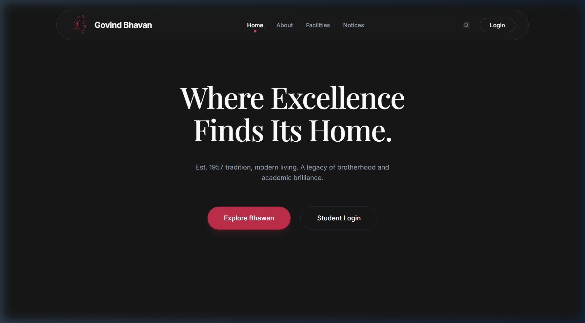
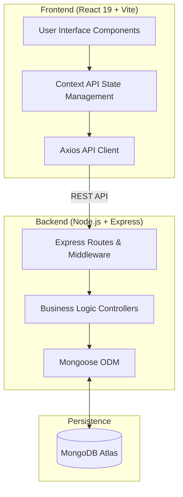

# Govind Bhavan Portal

> A robust, full-stack student management system engineered for high-performance residential governance.



## 🏗 Architecture & Design Patterns

The Govind Bhavan Portal is built using a decoupled, full-stack architecture designed for scalability, security, and maintainable state management.

### System Overview
- **Backend**: Node.js Express server providing a RESTful API layer with Mongoose for MongoDB data modeling.
- **Frontend**: React 19 optimized with Vite for lightning-fast HMR and low-latency production builds.
- **Styling**: Tailwind CSS v4 utilizing a custom tokens-based design system for UI consistency.
- **State Management**: Atomic React Context providers segmented by domain (Auth, Mess, Student Data).



## 🚀 Key Technical Features

### 🔐 Security & Role-Based Access (RBAC)
- **Granular Scoping**: All API endpoints and frontend views are strictly scoped based on the authenticated user's role (`Admin` vs. `Student`) and unique MongoDB `_id`.
- **Validation**: Mission-critical data mutations (Guest Bookings, Mess Rebates, Event Registration) are protected by server-side Zod validators to ensure business logic integrity.

### 📊 Data Intelligence & Management
- **Enterprise CSV Export**: A custom-built serialization utility leveraging the `file-saver` engine to bypass cross-browser blob restrictions, ensuring clean, formatted data exports.
- **Dynamic Mess Management**: A rating-weighted dining system allowing students to provide real-time sentiment analysis for daily meals.
- **Event Orchestration**: High-concurrency event registration system with real-time capacity monitoring and automated expiry tracking.

### 🛠 Tech Stack Details
| Layer | Technologies |
| :--- | :--- |
| **Frontend** | React 19, TypeScript, Vite, Tailwind CSS v4 |
| **Animation** | Framer Motion (`motion/react`) |
| **Backend** | Node.js, Express.js, TypeScript, TSX |
| **Database** | MongoDB (Atlas), Mongoose |
| **Data Export** | file-saver, CSV Data URIs |
| **Validation** | React Hook Form, Zod |

## 📦 Getting Started

### Prerequisites
- Node.js (v18+)
- MongoDB Atlas (or a local MongoDB instance)

### Installation & Execution

1. **Clone & Install**:
   ```bash
   npm install
   ```

2. **Environment Configuration**:
   Create a `.env.local` file in the root directory:
   ```env
   MONGODB_URI=your_mongodb_connection_string
   JWT_SECRET=your_production_grade_secret
   ```

3. **Initialize Database**:
   Populate the database with a professional seed dataset:
   ```bash
   npm run seed
   ```

4. **Launch Application**:
   Starts both the React development server and the Express API concurrently:
   ```bash
   npm run dev:full
   ```

## 🔌 API Documentation Interface

| Endpoint | Method | Description |
| :--- | :--- | :--- |
| `/api/auth/request-otp` | `POST` | Initiates OTP-based authentication flow. |
| `/api/students` | `GET` | Paginated retrieval of student records (Admin only). |
| `/api/complaints` | `POST` | Identity-locked complaint submission for students. |
| `/api/rebates` | `PATCH` | State mutation for mess rebate requests. |
| `/api/messmenu` | `PUT` | Global update for the weekly dining schedule. |

---
*Built with precision for the Govind Bhavan student community.*
